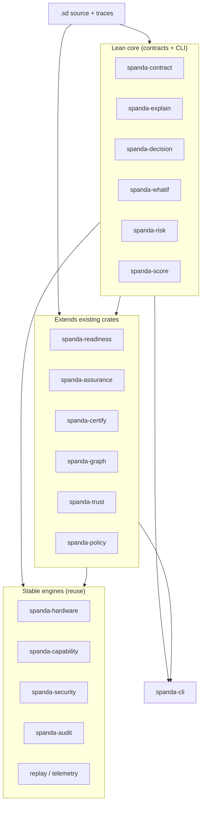

# Differentiation Roadmap

Strategic expansion plan for **signature platform capabilities** that differentiate Spanda as the **Safety, Verification, Readiness, Assurance, Diagnosis, Recovery, Trust, and Continuity** platform for autonomous systems.

This document extends — does not replace — [platform-maturity-roadmap.md](./platform-maturity-roadmap.md). Every item **composes** existing engines (`spanda-readiness`, `spanda-assurance`, `spanda-capability`, `spanda-hardware`, `spanda-security`, `spanda-audit`, replay, simulation) rather than duplicating them.

**Principle:** Lean core. Heavy implementations ship as **packages**. Contracts and CLI live in focused crates.

**Related:** [roadmap.md](./roadmap.md) · [product-strategy.md](./product-strategy.md) · [feature-status.md](./feature-status.md) · [platform-maturity-roadmap.md](./platform-maturity-roadmap.md)

**Last updated:** 2026-06-24

---

## Signature capabilities

These six capabilities define Spanda's market identity. Protect them in every release decision.

| # | Capability | What it means | Current home |
|---|------------|---------------|--------------|
| 1 | **Safety-Typed AI** | `ActionProposal` cannot reach actuators; only `SafeAction` from `safety.validate()` can. Compile-time and runtime enforced. | `spanda-typecheck`, `spanda-safety`, runtime gate |
| 2 | **Mission Contracts** | Missions as verifiable first-class entities with guarantees, constraints, assumptions, invariants, and objectives. | **Planned** — `spanda-contract` |
| 3 | **Readiness Engine** | Weighted go/no-go scoring across health, verify, safety, trust, and mission achievability. | `spanda-readiness` (**Stable**) |
| 4 | **Continuity & Takeover** | Checkpoint resume, delegation, succession, safety-gated takeover across robots and fleet. | `spanda-assurance` continuity (**Stable**) |
| 5 | **Trust Framework** | Composite trust scoring across packages, hardware, configuration, identity, and safety integrity. | **Planned** — `spanda-trust` |
| 6 | **Explainability & Audit Trail** | Why did the system decide X? Decision → evidence → safety check → action, with trace replay. | **Planned** — `spanda-explain`, `spanda-decision` |

### Questions Spanda uniquely answers

| Question | Answered by |
|----------|-------------|
| Can this mission run? | Mission Contracts + Readiness + `spanda verify` |
| Can this robot safely perform this mission? | Safety-Typed AI + Safety Coverage + `safety { }` |
| Does the hardware satisfy the required capabilities? | `spanda verify` + capability traceability |
| Is the system healthy enough to deploy? | Readiness Engine + Health Framework |
| Can it run safely? | Safety-Typed AI + Safety Coverage |
| Can it recover? | Recovery Coverage + Recovery Framework |
| Can it continue? | Continuity & Takeover |
| Who can take over when a robot or fleet member fails mid-mission? | Continuity & Takeover + Succession Planning |
| Can it be trusted? | Trust Framework + Certification Packs |
| Why should this deployment be trusted? | Trust Framework + Readiness + Assurance evidence |
| Why did it behave this way? | Explainability + Decision Audit Trail |
| What happened when something failed? | Diagnosis Engine + Replay + Decision Audit Trail |
| What evidence supports deployment? | Certification Packs + Assurance Cases |

---

## Priority classification

| Horizon | Timeline | Areas |
|---------|----------|-------|
| **NOW** | 0–3 months (v0.5+) | Mission Contracts, Explainability, Decision Audit Trail, Safety Coverage, Recovery Coverage |
| **NEXT** | 3–6 months (v0.6) | What-If Analysis, Mission Risk Analysis, Readiness Forecasting, Trust Graph, Scorecards |
| **LATER** | 6–12 months (v0.7–v1.0) | Digital Mission Twin, Certification Packs, Mission Time Travel Enhancements, Human/Robot Teaming, Autonomous Governance |

### NOW — verifiable missions and explainable operations

| # | Area | CLI (target) | Crate | Status |
|---|------|--------------|-------|--------|
| 1 | Mission Contracts | `spanda contract verify`, `spanda mission verify` (extended) | `spanda-contract` | **Planned** |
| 2 | Explainability | `spanda explain <file>`, `spanda explain mission.trace` | `spanda-explain` | **Planned** |
| 3 | Decision Audit Trail | embedded in traces; `spanda audit decisions` | `spanda-decision` | **Planned** |
| 4 | Safety Coverage | `spanda safety-coverage <file>` | extends `spanda-readiness` | **Planned** |
| 5 | Recovery Coverage | `spanda recovery-coverage <file>` | extends `spanda-assurance` | **Planned** |

### NEXT — predictive operations and executive visibility

| # | Area | CLI (target) | Crate | Status |
|---|------|--------------|-------|--------|
| 6 | What-If Analysis | `spanda what-if <file>` | `spanda-whatif` | **Experimental** |
| 7 | Mission Risk Analysis | `spanda risk <file>` | `spanda-risk` | **Planned** |
| 8 | Readiness Forecasting | `spanda readiness forecast` | extends `spanda-readiness` | **Planned** |
| 9 | Trust Graph | `spanda trust-graph <file>` | `spanda-graph` + `spanda-trust` | **Planned** |
| 10 | Scorecards | `spanda score <file>` | `spanda-score` | **Planned** |

### LATER — digital twin, certification, teaming, governance

| # | Area | CLI (target) | Crate | Status |
|---|------|--------------|-------|--------|
| 11 | Digital Mission Twin | `spanda twin mission` | extends `spanda-readiness` twin | **Future** |
| 12 | Certification Packs | `spanda certify <file>` (bundle export) | `spanda-certify` + `spanda-audit` | **Future** |
| 13 | Mission Time Travel | `spanda replay <trace> --at <ts>` | extends replay | **Future** |
| 14 | Human/Robot Teaming | `requires approval`, escalation paths | extends runtime + `spanda-contract` | **Future** |
| 15 | Autonomous Governance | `policy { }` blocks | `spanda-policy` | **Future** |

---

## Roadmap areas

### 1. Mission Contracts

**Goal:** Make missions verifiable first-class entities.

**Language constructs:**

```spanda
mission WarehousePatrol {
    guarantees:
        all_checkpoints_visited;
    safety:
        no_collision;
    continuity:
        auto_takeover;

    constraint max_duration = 2 h;
    assumption gps_available;
    invariant battery_level > 20%;
    objective visit_all_zones;
}
```

**Core types:** `MissionContract`, `MissionGuarantee`, `MissionConstraint`, `MissionAssumption`, `MissionInvariant`, `MissionObjective`.

**Verify:** guarantees, assumptions, constraints, completion requirements.

**Integrates with:** `spanda verify`, Readiness (`mission verify`), Assurance (`assurance_case`), Continuity (`continuity_policy`).

See [mission-contracts.md](./mission-contracts.md).

---

### 2. Explainability Framework

**Goal:** Explain autonomous behavior — static analysis and trace-backed decisions.

**Core types:** `ExplanationEngine`, `DecisionExplanation`, `MissionExplanation`, `SafetyExplanation`, `RecoveryExplanation`.

**CLI:**

```bash
spanda explain mission.trace
spanda explain rover.sd
spanda explain readiness --file rover.sd
```

**Output:** Decision, Reason, Evidence, Alternatives Considered, Safety Rules Applied.

**Integrates with:** Assurance diagnosis, Readiness failures, Replay traces, Audit records.

Extends [platform-maturity Area 7](./explainability.md). See [explainability.md](./explainability.md).

---

### 3. Decision Audit Trail

**Goal:** Trace every important decision through the operational stack.

**Core types:** `DecisionRecord`, `DecisionEvidence`, `DecisionTimeline`, `DecisionChain`.

**Trace chain:**

```
Mission → Decision → Evidence → Safety Check → Action
```

**Integrates with:** Mission trace replay (`--record`), `spanda-audit`, Assurance evidence, Telemetry store.

Emitted automatically during `run`/`sim` when `SPANDA_DECISION_TRACE=1`. Consumed by `spanda explain` and `spanda replay --at`.

See [decision-audit-trail.md](./decision-audit-trail.md).

---

### 4. Digital Mission Twin

**Goal:** Maintain a digital representation of mission state — progress, health, readiness, risks, recovery status.

**Core types:** `MissionTwin`, `MissionStateModel`, `MissionRiskModel`, `MissionForecast`.

**Integrates with:** Existing `twin` blocks, Readiness twin module, Telemetry store, What-If (NEXT), Replay (LATER).

Extends local digital twin — **not** a cloud SaaS. Heavy forecasting backends ship as packages.

See [digital-mission-twin.md](./digital-mission-twin.md) (LATER).

---

### 5. What-If Analysis

**Goal:** Predict mission outcomes under failure scenarios.

**CLI:**

```bash
spanda what-if mission.sd
spanda what-if mission.sd --scenario gps_failure
```

**Scenarios:** GPS failure, battery failure, connectivity loss, robot failure, fleet failure, swarm failure, provider failure, package failure.

**Output:** Impact, Risk, Recovery Plan, Probability (heuristic v1; package ML backends optional).

**Integrates with:** Recovery planner, Assurance resilience, Sim fault injection, Readiness degradation model.

See [what-if-analysis.md](./what-if-analysis.md) (NEXT).

---

### 6. Mission Risk Analysis

**Goal:** Assess deployment risk before field operation.

**Core types:** `MissionRiskAssessment`, `MissionRiskScore`, `MissionRiskFactor`.

**CLI:**

```bash
spanda risk mission.sd
spanda risk mission.sd --json
```

**Output:** Risk Score, Risk Contributors, Recommended Mitigations.

**Integrates with:** Readiness, Safety Coverage, Recovery Coverage, Trust Framework, `spanda verify`.

See [mission-risk-analysis.md](./mission-risk-analysis.md) (NEXT).

---

### 7. Safety Coverage

**Goal:** Coverage reporting for safety scenarios.

**Core types:** `SafetyCoverageReport`, `SafetyScenario`, `CoverageGap`.

**CLI:**

```bash
spanda safety-coverage rover.sd
```

**Scenarios evaluated:** Obstacle avoidance, GPS failure, battery failure, connectivity failure, provider failure, takeover failure, recovery failure.

**Output per scenario:** Covered · Partially Covered · Uncovered.

**Integrates with:** Safety auditor, `simulate_compatibility`, Recovery policies, Continuity policies, Readiness safety factor.

See [safety-coverage.md](./safety-coverage.md).

---

### 8. Recovery Coverage

**Goal:** Measure recovery readiness against known failure modes.

**Core types:** `RecoveryCoverageReport`, `RecoveryScenario`, `RecoveryGap`.

**CLI:**

```bash
spanda recovery-coverage rover.sd
```

**Output:** Known Failures, Recovery Plans, Coverage %, Missing Recovery Paths.

**Integrates with:** `recovery_policy`, Recovery planner, Assurance resilience, Chaos (platform-maturity Area 8).

See [recovery-coverage.md](./recovery-coverage.md).

---

### 9. Readiness Forecasting

**Goal:** Predict future readiness and time-based degradation.

**Core types:** `ReadinessHistory`, `ReadinessForecast`, `ReadinessPrediction`.

**CLI:**

```bash
spanda readiness forecast rover.sd
spanda readiness trends          # history from .spanda/readiness-history.json
```

**Evaluates:** Current readiness, future readiness, projected risks, time-based degradation.

Extends [readiness-trends.md](./readiness-trends.md) (platform-maturity Area 10).

---

### 10. Trust Graph

**Goal:** Visualize trust relationships across the deployment stack.

**Core types:** `TrustGraph`, `TrustDependency`, `TrustPath`.

**Chain:**

```
Mission → Capability → Hardware → Package → Provider → Trust Score
```

**CLI:**

```bash
spanda trust-graph rover.sd
spanda trust-graph rover.sd --format mermaid
```

Composes [dependency-graphs.md](./dependency-graphs.md) (Area 2) with [trust-framework.md](./trust-framework.md) (Area 11).

---

### 11. Certification Packs

**Goal:** Generate deployment-ready evidence bundles.

**Core types:** `CertificationPack`, `CertificationEvidence`, `ComplianceEvidence`.

**CLI:**

```bash
spanda certify rover.sd
spanda certify rover.sd --bundle deployment-evidence.zip
```

**Bundle includes:** Verification evidence, Safety evidence, Readiness evidence, Assurance evidence, Trust evidence, Traceability evidence.

Extends existing `certify` metadata and `spanda certify prove`. **Templates, not accredited certifications.**

See [certification-packs.md](./certification-packs.md) (LATER).

---

### 12. Mission Time Travel

**Goal:** Replay mission state at any point in time.

**Core types:** `MissionTimeTravel`, `HistoricalMissionState`, `TimelineExplorer`.

**CLI:**

```bash
spanda replay mission.trace --at 2026-06-24T14:32:00Z
spanda replay mission.trace --at 14:32:00 --inspect decisions|health|readiness|safety
```

**Capabilities:** Inspect state, decisions, health, readiness, safety at timestamp.

Extends [replay.md](./replay.md) v3 traces with decision snapshots. Consumes Decision Audit Trail.

See [mission-time-travel.md](./mission-time-travel.md) (LATER).

---

### 13. Human / Robot Teaming

**Goal:** Support collaborative autonomy with verified approval and escalation paths.

**Core types:** `HumanApproval`, `HumanOverride`, `HumanEscalation`, `HumanReview`.

**Example:**

```spanda
mission Patrol {
    requires approval Operator;
    escalation on critical_fault -> Supervisor;
}
```

**Verify:** Approval path, escalation path, fallback path.

Builds on existing `requires approval`, `SPANDA_OPERATOR_APPROVAL`, and Recovery approval hooks.

See [human-robot-teaming.md](./human-robot-teaming.md) (LATER).

---

### 14. Autonomous Governance

**Goal:** Policy-driven operational rules for autonomous systems.

**Core types:** `GovernancePolicy`, `OperationalPolicy`, `MissionPolicy`, `RiskPolicy`.

**Example:**

```spanda
policy NightOps {
    no_operation_after 22:00;
    max_speed = 2 m/s;
}
```

Extends [policy-engine.md](./policy-engine.md) (platform-maturity Area 5). Verify-time first; runtime enforcement in LATER phase.

---

### 15. Autonomous Systems Scorecard

**Goal:** Executive-level platform assessment.

**Core types:** `Scorecard`, `SafetyScore`, `ReadinessScore`, `TrustScore`, `ResilienceScore`, `AssuranceScore`, `RiskScore`.

**CLI:**

```bash
spanda score rover.sd
spanda score rover.sd --json --format markdown
```

**Output:** Category scores, overall score, recommendations.

Pure composition layer — no duplicate scoring logic. See [scorecards.md](./scorecards.md).

---

## Architecture impact analysis

### Lean-core principle



### Impact by subsystem

| Subsystem | Impact | Risk | Mitigation |
|-----------|--------|------|------------|
| Parser / AST | `mission { }` contract blocks; `policy { }` (LATER) | Medium | Opt-in keywords; experimental gate in docs |
| Type checker | Contract rule types; policy types | Low | New decl kinds; SafeAction gate unchanged |
| `spanda-readiness` | Safety/recovery coverage, forecast, scorecard composition | Medium | Additive APIs only |
| `spanda-assurance` | Recovery coverage, decision evidence, contract verify | Medium | Compose existing planners |
| `spanda-verify` | Contract + coverage hooks | Low | New flags; default behavior identical |
| Replay / telemetry | Decision records, time-travel snapshots | Medium | Trace format version field |
| Runtime | Decision emission, human approval paths | Medium | Feature flags; off by default |
| Packages | ML forecast backends, secure-boot attestation | Low | Package-only |

### No-regression contract

1. All existing CLI commands, flags, and JSON schemas remain valid.
2. Default `check`, `verify`, `readiness`, `sim`, `replay` behavior unchanged.
3. New commands are additive.
4. CI golden paths (`killer_demo`, `continuity_smoke`, `cargo test --workspace`) pass after each phase.

### Out of scope (explicit)

- Replace ROS2, PX4, or incumbent middleware
- Custom OS or database
- Blockchain (community packages only)
- Custom AI model platform (orchestrate via `extern python` / packages)

---

## Package vs core ownership

| Component | Core | Package | Notes |
|-----------|------|---------|-------|
| Mission contract syntax + static verify | ✓ `spanda-contract` | | Parser, AST, typecheck |
| Contract runtime enforcement | ✓ interpreter hooks | | Lightweight guards |
| Explainability (static) | ✓ `spanda-explain` | | Composes diagnostics |
| Explainability (trace decisions) | ✓ `spanda-decision` | | Trace format in core |
| Decision audit trail emission | ✓ runtime + audit | | |
| Safety / recovery coverage analysis | ✓ readiness + assurance | | Scenario catalog in core |
| What-if scenario engine | ✓ `spanda-whatif` | | Heuristic v1 in core |
| What-if ML probability | | `spanda-whatif-ml` | Optional ONNX backend |
| Mission risk scoring | ✓ `spanda-risk` | | |
| Readiness forecast (heuristic) | ✓ `spanda-readiness` | | |
| Readiness forecast (learned) | | `spanda-readiness-ml` | Package backend |
| Trust graph visualization | ✓ `spanda-graph` | | |
| Trust attestation (TPM, secure boot) | | `spanda-trust-jetson`, `spanda-trust-pi` | Vendor-specific |
| Scorecard rollup | ✓ `spanda-score` | | Pure composition |
| Digital mission twin (local) | ✓ readiness twin | | |
| Digital mission twin (cloud sync) | | `spanda-twin-cloud` | Future package |
| Certification pack export | ✓ `spanda-certify` | | |
| Compliance profile templates | ✓ `spanda-compliance` | | Industry packs as packages |
| Mission time travel | ✓ replay extensions | | |
| Human approval UI | | `spanda-approval-console` | Web/console package |
| Autonomous governance runtime | ✓ `spanda-policy` | | Verify-time first |
| GPS spoofing cross-check | | `spanda-spoofing-gps` | Per platform-maturity |

---

## Integration mapping

Every roadmap area integrates with the platform engines. ✓ = primary integration; ○ = secondary.

| Area | Readiness | Assurance | Diagnosis | Recovery | Trust | Health | Continuity | Mission Verify | Cap Verify | HW Verify | Simulation | Replay | Audit | Traceability |
|------|-----------|-----------|-----------|----------|-------|--------|------------|----------------|------------|-----------|------------|--------|-------|--------------|
| Mission Contracts | ✓ | ✓ | ○ | ○ | ○ | ○ | ✓ | ✓ | ✓ | ✓ | ○ | ○ | ✓ | ✓ |
| Explainability | ✓ | ✓ | ✓ | ✓ | ○ | ✓ | ✓ | ✓ | ○ | ✓ | ○ | ✓ | ✓ | ✓ |
| Decision Audit Trail | ✓ | ✓ | ✓ | ✓ | ○ | ✓ | ✓ | ○ | ○ | ○ | ✓ | ✓ | ✓ | ✓ |
| Safety Coverage | ✓ | ✓ | ○ | ✓ | ○ | ✓ | ✓ | ✓ | ✓ | ✓ | ✓ | ○ | ✓ | ✓ |
| Recovery Coverage | ✓ | ✓ | ✓ | ✓ | ○ | ✓ | ✓ | ○ | ✓ | ✓ | ✓ | ✓ | ✓ | ✓ |
| What-If Analysis | ✓ | ✓ | ✓ | ✓ | ○ | ✓ | ✓ | ✓ | ✓ | ✓ | ✓ | ○ | ○ | ✓ |
| Mission Risk Analysis | ✓ | ✓ | ✓ | ✓ | ✓ | ✓ | ✓ | ✓ | ✓ | ✓ | ✓ | ○ | ✓ | ✓ |
| Readiness Forecasting | ✓ | ✓ | ✓ | ○ | ✓ | ✓ | ○ | ✓ | ○ | ○ | ○ | ✓ | ✓ | ○ |
| Trust Graph | ✓ | ○ | ○ | ○ | ✓ | ○ | ○ | ✓ | ✓ | ✓ | ○ | ○ | ✓ | ✓ |
| Scorecards | ✓ | ✓ | ✓ | ✓ | ✓ | ✓ | ✓ | ✓ | ✓ | ✓ | ✓ | ✓ | ✓ | ✓ |
| Digital Mission Twin | ✓ | ✓ | ✓ | ✓ | ✓ | ✓ | ✓ | ✓ | ○ | ○ | ✓ | ✓ | ✓ | ✓ |
| Certification Packs | ✓ | ✓ | ○ | ✓ | ✓ | ✓ | ✓ | ✓ | ✓ | ✓ | ○ | ✓ | ✓ | ✓ |
| Mission Time Travel | ✓ | ✓ | ✓ | ✓ | ○ | ✓ | ✓ | ○ | ○ | ○ | ✓ | ✓ | ✓ | ✓ |
| Human/Robot Teaming | ✓ | ✓ | ○ | ✓ | ✓ | ✓ | ✓ | ✓ | ○ | ○ | ○ | ✓ | ✓ | ○ |
| Autonomous Governance | ✓ | ✓ | ○ | ✓ | ✓ | ✓ | ✓ | ✓ | ✓ | ✓ | ✓ | ○ | ✓ | ✓ |

### Crate dependency graph (planned)

```
spanda-contract    → spanda-ast, spanda-readiness, spanda-assurance, spanda-capability, spanda-hardware
spanda-explain     → spanda-assurance, spanda-readiness, spanda-hardware, spanda-decision
spanda-decision    → spanda-audit, spanda-assurance
spanda-whatif      → spanda-assurance, spanda-readiness, spanda-hardware, spanda-interpreter (inject)
spanda-risk        → spanda-readiness, spanda-contract, spanda-assurance
spanda-score       → spanda-readiness, spanda-assurance, spanda-risk, spanda-trust
spanda-graph       → spanda-ast, spanda-capability, spanda-trust (trust-graph mode)
```

Coverage analysis extends `spanda-readiness` and `spanda-assurance` — no new crates for safety/recovery coverage.

---

## Documentation plan

### Master documents

| Document | Action | When |
|----------|--------|------|
| [differentiation-roadmap.md](./differentiation-roadmap.md) | Created (this file) | Now |
| [roadmap.md](./roadmap.md) | Add Differentiation section | Now |
| [product-strategy.md](./product-strategy.md) | Signature capabilities section | Now |
| [feature-status.md](./feature-status.md) | Planned differentiation matrix | Now |

### Topic design specs

| Document | Area | Horizon |
|----------|------|---------|
| [mission-contracts.md](./mission-contracts.md) | Mission Contracts | NOW |
| [explainability.md](./explainability.md) | Explainability | NOW (exists) |
| [decision-audit-trail.md](./decision-audit-trail.md) | Decision Audit Trail | NOW |
| [safety-coverage.md](./safety-coverage.md) | Safety Coverage | NOW |
| [recovery-coverage.md](./recovery-coverage.md) | Recovery Coverage | NOW |
| [what-if-analysis.md](./what-if-analysis.md) | What-If Analysis | NEXT |
| [mission-risk-analysis.md](./mission-risk-analysis.md) | Mission Risk Analysis | NEXT |
| [readiness-trends.md](./readiness-trends.md) | Readiness Forecasting | NEXT (exists) |
| [trust-framework.md](./trust-framework.md) + [dependency-graphs.md](./dependency-graphs.md) | Trust Graph | NEXT |
| [scorecards.md](./scorecards.md) | Scorecards | NEXT (exists) |
| [digital-mission-twin.md](./digital-mission-twin.md) | Digital Mission Twin | LATER |
| [certification-packs.md](./certification-packs.md) | Certification Packs | LATER |
| [mission-time-travel.md](./mission-time-travel.md) | Mission Time Travel | LATER |
| [human-robot-teaming.md](./human-robot-teaming.md) | Human/Robot Teaming | LATER |
| [policy-engine.md](./policy-engine.md) | Autonomous Governance | LATER (exists) |

### Per-phase updates

When each area ships: `CHANGELOG.md`, `feature-status.md`, `getting-started.md` (if demo-worthy), `docs/README.md`, and `README.md` signature section.

---

## Demo plan

### `spanda demo differentiation` (NOW phase exit criteria)

Single scripted demo covering the five NOW areas on `examples/showcase/differentiation/`:

| Step | Command | Audience sees |
|------|---------|---------------|
| 1 | Show `mission WarehousePatrol { guarantees: … }` | Verifiable mission contract in source |
| 2 | `spanda contract verify warehouse.sd` | Guarantee/constraint/assumption report |
| 3 | `spanda safety-coverage warehouse.sd` | Scenario coverage matrix |
| 4 | `spanda recovery-coverage warehouse.sd` | Recovery path coverage % |
| 5 | `spanda sim warehouse.sd --record` + inject fault | Decision trail in trace |
| 6 | `spanda explain mission.trace` | Decision, reason, evidence, safety rules |

### Showcase examples (by horizon)

| Example | Demonstrates | Horizon |
|---------|--------------|---------|
| `examples/showcase/differentiation/warehouse_patrol.sd` | Mission Contracts + coverage | NOW |
| `examples/showcase/differentiation/decision_trail/` | Decision audit + explain | NOW |
| `examples/showcase/what_if/gps_failure.sd` | What-if GPS failure | NEXT |
| `examples/showcase/risk/deployment_risk.sd` | Mission risk score | NEXT |
| `examples/showcase/trust_graph/rover.sd` | Trust dependency graph | NEXT |
| `examples/showcase/scorecard/executive.sd` | Executive scorecard | NEXT |
| `examples/showcase/mission_twin/patrol.sd` | Digital mission twin | LATER |
| `examples/showcase/certify/deployment_bundle/` | Certification pack export | LATER |
| `examples/showcase/time_travel/incident/` | Replay at timestamp | LATER |
| `examples/showcase/human_robot/approval_escalation.sd` | Human approval paths | LATER |

### CI smoke scripts

| Script | Covers |
|--------|--------|
| `scripts/differentiation_smoke.sh` | contract verify, safety-coverage, recovery-coverage, explain, decision trail audit/explain |
| `scripts/what_if_smoke.sh` | what-if scenarios (NEXT) |
| `scripts/scorecard_smoke.sh` | score rollup (NEXT) |

---

## Adoption impact analysis

### Personas and value

| Persona | NOW value | NEXT value | LATER value |
|---------|-----------|------------|-------------|
| **Robotics engineer** | Mission contracts in CI; safety/recovery coverage gaps before deploy | What-if failure scenarios; risk score in PR checks | Time-travel incident debug |
| **Safety engineer** | Verifiable guarantees; safety coverage report | Risk contributors + mitigations | Certification evidence bundle |
| **Ops / fleet manager** | Explainability on traces; decision audit | Readiness forecast; trust graph | Digital mission twin dashboard |
| **Executive / PM** | — | Scorecard with recommendations | Governance policies + certify pack |

### Adoption funnel impact

```
Week 1:  spanda check + verify (existing)
Week 2:  spanda contract verify + safety-coverage in CI  ← NOW unlock
Week 3:  spanda explain on mission traces               ← NOW unlock
Month 2: spanda risk + what-if in release gate          ← NEXT unlock
Month 3: spanda score for stakeholder reviews           ← NEXT unlock
Month 6: spanda certify bundle for field deployment     ← LATER unlock
```

### Competitive differentiation lift

| Capability | Before | After differentiation |
|------------|--------|----------------------|
| Mission verifiability | `mission verify` (achievability) | Full contract with guarantees/constraints |
| Post-incident explanation | `spanda diagnose` (root cause) | Decision chain with evidence and alternatives |
| Deploy confidence | Readiness score | Coverage matrices + risk score + scorecard |
| Trust narrative | Audit records (local) | Trust graph + certification packs |
| Executive story | Fragmented CLI reports | Single `spanda score` rollup |

### Risks and mitigations

| Risk | Mitigation |
|------|------------|
| Overlap with platform-maturity roadmap | Explicit composition; cross-links in both docs |
| Contract syntax complexity | Start with 5 constructs; expand from user feedback |
| False confidence from heuristic what-if | Label probabilities as estimates; require human review |
| Certification pack liability | Mark as evidence templates, not accredited certs |
| Trace format churn | Version field on decision records; backward-compatible replay |

---

## Phased implementation

### Phase 1 — Verifiable missions (NOW, v0.5+)

| Deliverable | Tests |
|-------------|-------|
| `mission { }` contract syntax + AST | Parser golden fixtures |
| `spanda contract verify` | Contract pass/fail CI |
| Safety coverage report | Scenario matrix golden JSON |
| Recovery coverage report | Coverage % golden JSON |
| Decision record emission in traces | Trace schema v3 tests |
| `spanda explain` (static + trace) | Fixture explanations |

**Exit:** `spanda demo differentiation` + `scripts/differentiation_smoke.sh` green.

### Phase 2 — Predictive operations (NEXT, v0.6)

| Deliverable | Tests |
|-------------|-------|
| `spanda what-if` | Scenario injection tests |
| `spanda risk` | Risk score golden JSON |
| `spanda readiness forecast` | History + forecast fixtures |
| `spanda trust-graph` | Mermaid golden output |
| `spanda score` | Scorecard composition tests |

**Exit:** CI scorecard + what-if on showcase examples.

### Phase 3 — Field trust (LATER, v0.7–v1.0)

| Deliverable | Tests |
|-------------|-------|
| Digital mission twin | Twin state sync tests |
| `spanda certify --bundle` | Bundle contents manifest |
| `spanda replay --at` | Time-travel snapshot tests |
| Human approval verify paths | Approval/escalation CI |
| `policy { }` verify-time | Policy violation fixtures |

**Exit:** End-to-end field deployment evidence workflow documented.

---

## Related documents

- [platform-maturity-roadmap.md](./platform-maturity-roadmap.md) — adoption, trust, operations (16 areas)
- [mission-contracts.md](./mission-contracts.md) · [decision-audit-trail.md](./decision-audit-trail.md)
- [safety-coverage.md](./safety-coverage.md) · [recovery-coverage.md](./recovery-coverage.md)
- [explainability.md](./explainability.md) · [scorecards.md](./scorecards.md) · [trust-framework.md](./trust-framework.md)
- [mission-continuity.md](./mission-continuity.md) · [readiness.md](./readiness.md) · [replay.md](./replay.md)
