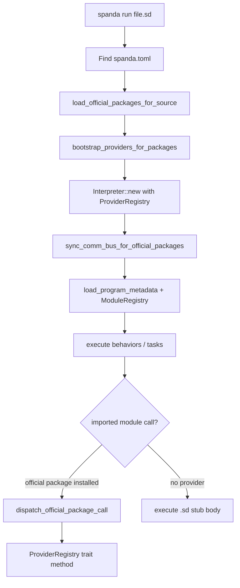

# How Runtime Resolution Works

Runtime resolution connects Spanda source imports to installed packages, provider backends, and the communication bus.

## End-to-end flow



## Resolution layers

### 1. Project discovery

`load_official_packages_for_source(path)` walks from the `.sd` file to the project root, then reads `spanda.lock` (or falls back to `spanda.toml` dependencies).

### 2. Module linking

`load_project_modules(root)` compiles:

- `src/` and `tests/` in the project
- `.spanda/packages/*/src/` for vendored dependencies

Imports like `import positioning.gps` resolve to exported functions in the module registry.

### 3. Provider bootstrap

`bootstrap_providers_for_packages` registers only providers for packages listed in the lockfile. Capabilities are granted per package (e.g. `spanda-mqtt` → `mqtt.publish`).

### 4. Transport routing

`RoutingCommBus` selects sim, local, or registry-backed transports. Robot `topic` declarations with `transport: MQTT` route through the `spanda-mqtt` transport provider when installed.

### 5. Call dispatch

When the interpreter calls an imported function (e.g. `read()` from `positioning.gps`):

1. Look up the source module path (`positioning.gps`)
2. Map to official package (`spanda-gps`)
3. If installed, dispatch to `ProviderRegistry`
4. Otherwise execute the `.sd` stub

### 6. Verification integration

`spanda verify` runs before deploy. It checks hardware profiles, memory, connectivity requirements, and package capability needs against declared `requires_hardware` and `requires_connectivity` blocks — independent of runtime loading but using the same manifest metadata.

## CLI commands in the resolution chain

| Command | Resolution step |
|---------|-----------------|
| `spanda install` | resolve → lock → vendor |
| `spanda update` | refresh lock + re-vendor |
| `spanda build` | install + compile with ModuleRegistry |
| `spanda run` / `spanda sim` | full pipeline + execute |
| `spanda verify` | hardware + certify (no execution) |

## Flagship demo

```bash
cd examples/showcase/autonomous_rover
spanda install
spanda verify src/rover.sd
spanda sim src/rover.sd --record
spanda run src/rover.sd --trace-providers
```

## See also

- [How Packages Work](./how-packages-work.md)
- [How Providers Work](./how-providers-work.md)
- [architecture.md](./architecture.md)
